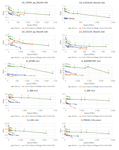

Stenos
------

Stenos is a compression library designed to compress binary structured data like arrays of integers or floating-point values. It serves the same purpose as the great <a href="https://github.com/Blosc/c-blosc2/tree/main">Blosc</a> library, and borrowed its optimized shuffling routines. 
Stenos relies on <a href="https://github.com/facebook/Zstd">Zstd</a> compression library.

As opposed to Blosc, Stenos does not need to be specified a filter like byte shuffling or bit shuffling. Instead, it tests several approaches and pick the most efficient compression method among:
-	SIMD Block compression. This algorithm compresses blocks of 256 elements using a combination of bit packing, delta coding, RLE and fast LZ-like algorithm using SSE 4.1 and/or AVX2 instruction sets. This algorithm can compress at more or less 2GB/s and decompress at 3GB/s. Zstd can then be applied on the residuals.
-	Zstd compression on the shuffled (transposed) input (similar to Blosc + Zstd)
-	Zstd compression on the shuffled + byte delta input
-	Direct Zstd compression without shuffling.

Despite all these possibilities, Stenos usually compress better and faster than Blosc + Zstd or lz4. 
The following graphs show the compression ratio versus speed for different types of data (dataset available <a href="https://github.com/Thermadiag/stenos_dataset">here</a>) and testing Stenos and Blosc+Zstd (byte shuffling + bit shuffling).
Benchmarks ran on an Intel(R) Core(TM) i7-10850H CPU @ 2.70GHz (AVX2 available) without multi-threading.



Stenos supports multi-threaded compression and decompression, but not (yet) streaming compression.

C++14 is required to compile Stenos.

Usage
-----

Basic usage in C++ (similar in C):

```cpp

#include <stenos/stenos.h>

#include <iostream>
#include <vector>
#include <algorithm>

int  main  (int , char** )
{
	// Fill a std::vector with sorted data
	std::vector<int> vec(1000000);
	for (size_t i = 0; i < vec.size(); ++i)
		vec[i] = (int)i;

	// Compute input bytes
	size_t bytes = vec.size() * sizeof(int);

	// Create the compressed buffer
	std::vector<char> dst(stenos_bound(bytes));

	// Compress with level 2 using the C interface
	size_t r = stenos_compress(vec.data(), sizeof(int), bytes, dst.data(), dst.size(), 2);
	// Check for error
	if (stenos_has_error(r))
		return -1;

	// Print compression ratio
	std::cout << "Ratio: " << (double)vec.size() / r << std::endl;


	// Advanced way: use a compression context (C interface)

	stenos_context* ctx = stenos_make_context();
	stenos_set_level(ctx, 2); // set the compression level
	stenos_set_threads(ctx, 4); // set the number of threads
	r = stenos_compress_generic(ctx, vec.data(), sizeof(int), bytes, dst.data(), dst.size());
	stenos_destroy_context(ctx);


	// Decompress

	std::vector<int> vec2(vec.size());
	size_t d = stenos_decompress(dst.data(), sizeof(int), r, vec2.data(), bytes);
	// Check for error
	if (stenos_has_error(d))
		return -1;

	// Check decompression
	if (!std::equal(vec.begin(), vec.end(), vec2.begin()))
		return -1;

	return 0;
}

```


Compression levels
------------------

Stenos compression level ranges from 0 (no compression) to 9 (maximum compression), like Blosc.
For multi-bytes elements (like arrays of 2-4-8 byte integers), the level 1 uses SIMD block compression without Zstd. This should only be used for situations where high compression speed is required (> 1GB/s), and higher compression levels should be used otherwise.


Time limited compression
------------------------

Stenos supports time limited compression. With this mode, the compression level is continuously adjusted during the compression process to achieve the highest possible compression ratio within a given time.
If, no matter what, the compression process is too slow to fulfill the required time limit, direct memcpy will be used to "compress" the remaining bytes.

The time precision highly depends on the target platform. Typically, on Windows, the compression process (almost) never exceeds the compression time by more than a millisecond.

Basic usage:

```cpp

#include <stenos/stenos.h>

#include <iostream>
#include <vector>
#include <algorithm>

int  main  (int , char** )
{
	// Fill a std::vector with sorted data
	std::vector<int> vec(1000000);
	for (size_t i = 0; i < vec.size(); ++i)
		vec[i] = (int)i;

	// Compute input bytes
	size_t bytes = vec.size() * sizeof(int);

	// Create the compressed buffer
	std::vector<char> dst(stenos_bound(bytes));


	// Advanced way: use a compression context

	stenos_context* ctx = stenos_make_context();
	stenos_set_max_nanoseconds(ctx, 1000000); // maximum 1 ms to compress
	size_t r = stenos_compress_generic(ctx, vec.data(), sizeof(int), bytes, dst.data(), dst.size());
	stenos_destroy_context(ctx);
	
	// Check for error
	if (stenos_has_error(r))
		return -1;
		
	// Print compression ratio
	std::cout << "Ratio: " << (double)vec.size() / r << std::endl;

	
	return 0;
}

```


Compressed vector
-----------------

Stenos library provides the C++ [stenos::cvector](docs/cvector.md) class providing a compressed vector container with a similar interface to std::vector. See this [documentation](docs/cvector.md) for more details.


Build
-----

The following cmake options are available:
-	*STENOS_ENABLE_AVX2*(ON): force AVX2 support (sometimes mandatory for Windows)
-	*STENOS_BUILD_ZSTD*(OFF) : build Zstd without trying to find it first
-	*STENOS_BUILD_TESTS*(OFF): build the tests
-	*STENOS_BUILD_BENCHS*(OFF): build the benchmarks
-	*STENOS_NO_WARNINGS*(OFF): treat warnings as errors
-	*STENOS_BUILD_SHARED*(ON): build shared version of Stenos
-	*STENOS_BUILD_STATIC*(ON): build static version of Stenos

If you link with the static version without using cmake, you must define STENOS_STATIC yourself.


Acknowledgements
----------------

The only library dependency is <a href="https://github.com/facebook/Zstd">Zstd</a> from Yann Collet. The library is fetched and built if not found on the system (or if STENOS_BUILD_ZSTD is ON).
Stenos uses a simplified version of <a href="https://github.com/lz4/lz4">LZ4</a> library, still by Yann Collet. A *dry* version of LZ4 (no output writing) is used to assess the compressibility of input blocks using a LZ-like algorithm.
Stenos also uses the accelerated byte shuffling code from the <a href="https://github.com/Blosc/c-blosc2/tree/main">Blosc</a> library.
All licenses are included in the the *LICENSES* folder.


stenos:: library and this page Copyright (c) 2025, Victor Moncada

